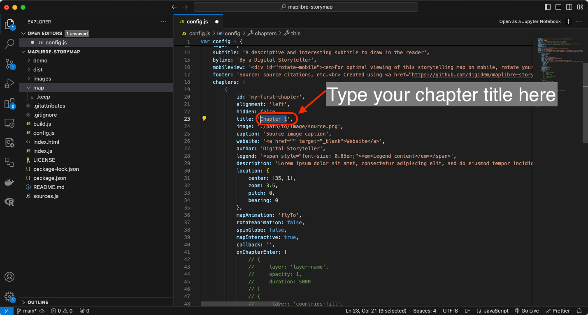
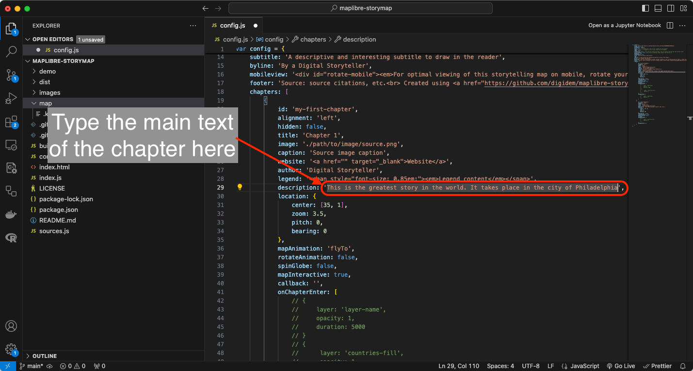
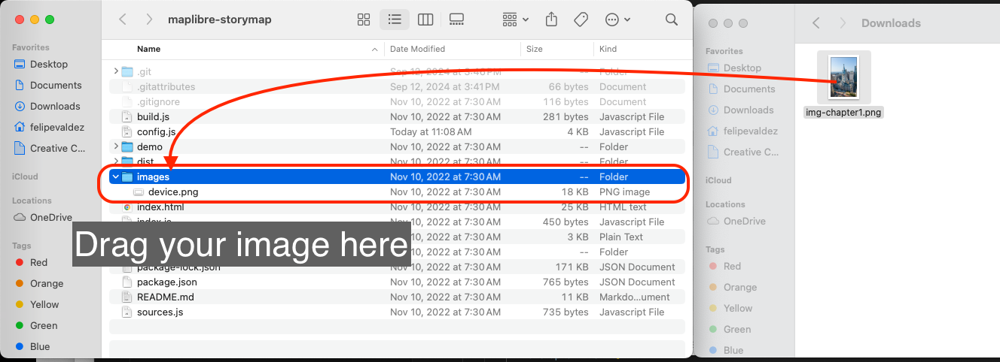
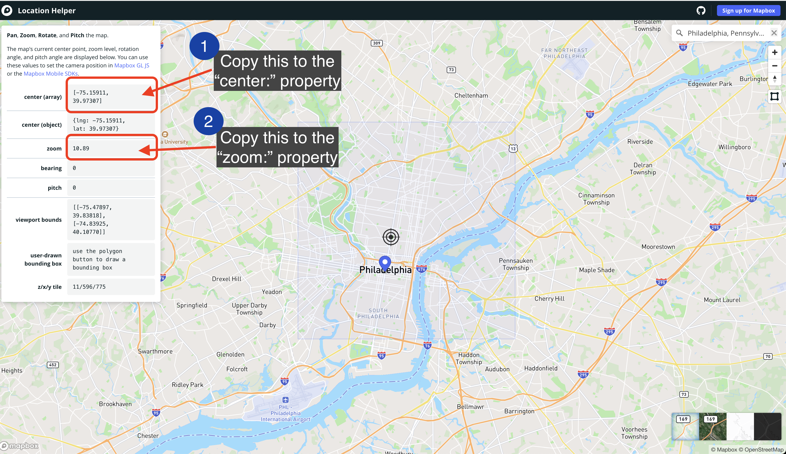
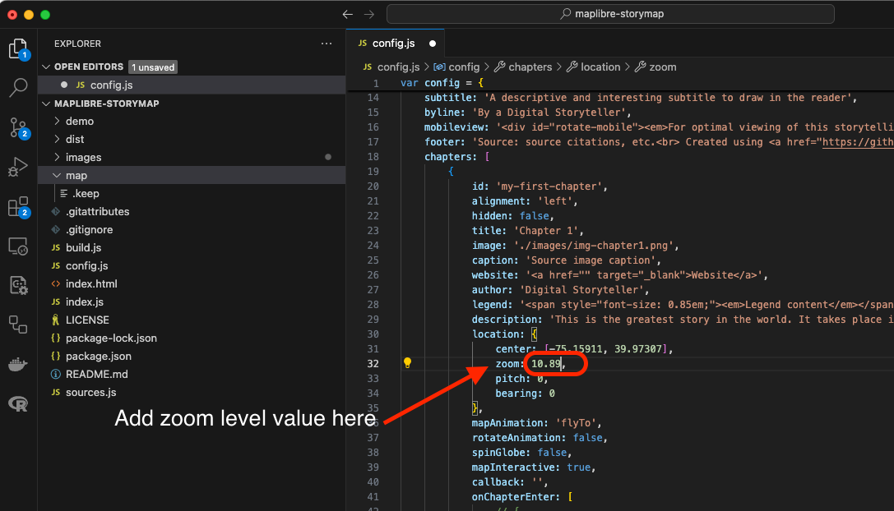
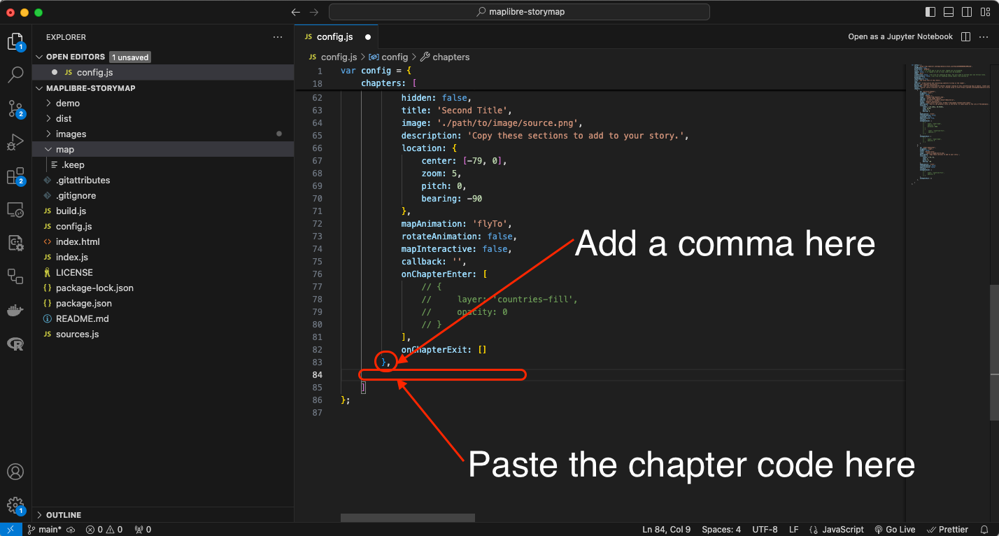

# Agregar capítulos

Ahora que tienes la configuración básica de tu mapa narrativo, es hora de agregar datos a tus capítulos.
Los capítulos contienen el contenido de tu historia. Cada uno es un recuadro con texto y multimedia que se desplazará sobre tu mapa base.

Necesitarás agregar y configurar algunos detalles en el archivo `config.js` para crear los capítulos de tu historia.
A partir de la línea 18 del archivo `config.js`, verás los capítulos y sus propiedades.

Al final de esta página tienes un detalle sobre la función de cada propiedad de los capítulos en el archivo `config.js`.
Repasaremos las propiedades básicas en los siguientes pasos.

### *1*{: .circle .circle-blue} Configurando tu primer capítulo.

Paso 1
{: .label .label-step}

Agrega un `id` a tu primer capítulo. Simplemente escribe cualquier texto que identifique tu primer capítulo.

Entrada
{: .label .label-green }
```
20  id: 'mi-primer-capitulo'
```
Recuerda usar guiones para separar palabras y letras minúsculas para el id del capítulo. 
{: .warn}


Paso 2
{: .label .label-step}

Agrega un `title` a tu capítulo. En la línea 23, agrega un texto para que sea el título de tu capítulo.

Entrada
{: .label .label-green }
```
23  title: 'Capítulo 1'
```


Paso 3
{: .label .label-step}

Agrega una `description` a tu capítulo. Esta sección contendrá el texto principal de este capítulo. En la línea 29, agrega todo el texto para este capítulo.

Entrada
{: .label .label-green }
```
29  description: 'Esta es la mejor historia del mundo. Tiene lugar en la ciudad de Filadelfia'
```


### *2*{: .circle .circle-blue} Agregando una imagen a tu capítulo.

Paso 1
{: .label .label-step}

Dale a la imagen que vas a usar un nombre simple pero fácil de identificar. Por ejemplo `img_capitulo1.png`.

Paso 2
{: .label .label-step}

1. En el navegador de tu sistema, navega hasta la carpeta del repositorio `maplibre-storymap`.

2. Dentro de esta carpeta verás otra carpeta llamada `images`.

3. Guarda tu imagen `img-capitulo1.png` en esta carpeta.



Paso 3
{: .label .label-step}

Regresa al archivo `config.js` en `Visual Studio Code` y agrega lo siguiente:

Entrada
{: .label .label-green }
```
24  image: './images/img-capitulo1.png'
```


### *3*{: .circle .circle-blue} Configurando la ubicación del capítulo en el mapa.

Otra característica de los mapas narrativos es la capacidad de centrar el mapa base en un punto específico para destacar la historia que estás contando. En esta demostración, estamos contando una historia sobre la ciudad de Filadelfia, vamos a ubicar el mapa para que muestre una vista general de la ciudad con el punto central en el Ayuntamiento.

La vista del mapa está controlada por las propiedades bajo `location:` desde la línea 31 hasta la 34 en el archivo `config.js`. Las dos primeras opciones, `center` y `zoom` son las más importantes ya que establecen las coordenadas donde se centra el mapa y cuán alejado o acercado está. Para ayudarte a decidir los valores de estas propiedades, vamos a usar la aplicación web [Location Helper](https://labs.mapbox.com/location-helper/#3/40.78/-73.97).

Paso 1
{: .label .label-step}

En tu navegador de internet, navega hasta la aplicación web [Location Helper](https://labs.mapbox.com/location-helper/#3/40.78/-73.97).

Verás un mapa y una ventana con algunos valores numéricos para `center (array)`, `center (object)`, `zoom`, `bearing`, `pitch` y otros en el lado izquierdo de la pantalla. Observa un círculo que marca el centro del mapa.

Navega por el mapa usando los `Controles de navegación` o la `Barra de búsqueda` en la esquina superior derecha de la pantalla, hasta que veas el mapa como quieres que se muestre en tu capítulo.


En esta demostración, escribimos en la barra de búsqueda `Philadelphia, Pennsylvania` y el mapa resultante se ve bien para el propósito del primer capítulo.



Paso 2
{: .label .label-step}

Copia los valores en la propiedad `center (array)` de la aplicación web `Location Helper` y pégalos en la propiedad `center:` en la línea 31 del archivo `config.js` que tienes abierto en Visual Studio Code.

Entrada
{: .label .label-green }
```
31  center: [-75.15911, 39.97307],
```
Ten en cuenta que las coordenadas están dentro de los símbolos [ ] y separadas por una coma. 
{: .warn}


Paso 3
{: .label .label-step}

Copia los valores en la propiedad `zoom` de la aplicación web `Location Helper` y pégalos en la propiedad `zoom:` en la línea 32 del archivo `config.js` que tienes abierto en Visual Studio Code.

Entrada
{: .label .label-green }
```
32  zoom: 10.89,
```



### *4*{: .circle .circle-blue} Agregando más capítulos a tu mapa narrativo.

La plantilla de Digital Democracy tiene dos capítulos agregados al mapa.

Un capítulo tiene la siguiente estructura:

```
{
            id: 'id-del-capitulo',
            alignment: 'left',
            hidden: false,
            title: 'Título del capítulo',
            image: './images/nombre.png',
            caption: 'Leyenda de la imagen fuente',
            website: '<a href="" target="_blank">Sitio web</a>',
            author: 'Narrador Digital',
            legend: '<span style="font-size: 0.85em;"><em>Contenido de la leyenda</em></span>',
            description: 'El contenido de tu capítulo',
            location: {
                center: [-75.15911, 39.97307],
                zoom: 10.89,
                pitch: 0,
                bearing: 0
            },
            mapAnimation: 'flyTo',
            rotateAnimation: false,
            spinGlobe: false,
            mapInteractive: true,
            callback: '',
            onChapterEnter: [],
            onChapterExit: []
        },
```
Para agregar nuevos capítulos a tu mapa narrativo, simplemente `copia` este texto y pégalo justo después del símbolo `}` que cierra el capítulo anterior. Asegúrate de incluir una `,` después del símbolo y pegar el texto antes del `]` que cierra la sección de capítulos en el código.



Agrega tantos capítulos como quieras.

No olvides agregar los datos y especificaciones necesarios en cada capítulo. En la siguiente sección de este tutorial aprenderás cómo previsualizar tu mapa narrativo.

Adelante, juega cambiando algunas configuraciones del capítulo como `alignment` y `rotateAnimation`.
{: .note }


| Propiedad | Función
| --- | ---
| `id:` | Un ID en estilo slug para el capítulo. Esto es leído por JavaScript que impulsa la aplicación y se asigna como un `id` HTML para el elemento `div` que contiene el resto de la historia. Un formato de buenas prácticas sería usar kebab case, como `mi-historia-capitulo-1`.
| `alignment:` | Define dónde debe aparecer el texto de la historia sobre el mapa. Las opciones son `center`, `left`, `right` y `full`.
| `hidden:` | Establece la visibilidad del capítulo como oculta cuando es `true`. El capítulo seguirá activando una transición de mapa y capa.
| `title:` | El título de la sección, mostrado en un elemento `h3`.
| `image:` | La ruta a una imagen para mostrar en esta sección.
| `caption:` | Agrega un pie de foto para la imagen.
| `author:` | Agrega un autor para mostrar en la parte inferior del capítulo.
| `website:` | Agrega un sitio web para mostrar en la parte inferior del capítulo.
| `legend:` | Agrega un cuadro de leyenda HTML para este capítulo. `legend` también debe estar habilitado en la configuración anterior.
| `description:` | El contenido principal de la historia para la sección. Esto debe estar alineado con lo que el lector está viendo en el mapa. En la versión básica, este campo se renderizará como HTML. Se pueden incluir imágenes, enlaces y otros elementos como HTML.
| `location:` | Detalles sobre la visualización del mapa y la vista de la cámara. `center`: Coordenadas centrales del mapa, como longitud, latitud. `zoom`: Nivel de zoom del mapa. `pitch`: Ángulo de la vista del mapa. 0 es recto hacia abajo, y 60 está muy inclinado. `bearing`: Grados de rotación en sentido horario desde el Norte (0). Los valores negativos representan rotación en sentido antihorario.
| `mapAnimation:` | Define el tipo de animación para la transición entre ubicaciones. Esta propiedad admite animaciones `flyTo`, `easeTo` y `jumpTo`. Si no se especifica, por defecto es `flyTo`.
| `rotateAnimation:` | Inicia una animación de rotación lenta al final de la transición del mapa cuando se establece en `true`. El mapa rotará 90 grados en 24 segundos.
| `mapInteractive:` | Cuando se establece en `true`, configura este capítulo para que sea interactivo, permitiendo al usuario desplazarse y hacer zoom en el mapa, y agrega controles de navegación.
| `callback:` | Acepta el nombre de una función JavaScript y ejecuta la función. Usa esto si tienes código personalizado que quieres ejecutar para un capítulo, como activar o desactivar una leyenda, agregar datos de una solicitud API o mostrar un gráfico interactivo.
| `onChapterEnter:` | Capas para ser mostradas/ocultadas/silenciadas cuando la sección se vuelve activa. `layer`: Nombre de la capa como se asigna en el estilo MapLibre. `opacity`: La opacidad para mostrar la capa. `0` es completamente transparente, `1` es completamente opaco. `duration`: La duración de la transición de opacidad, numérica, en milisegundos. El valor predeterminado es 300. Este es un parámetro opcional y puede omitirse.
| `onChapterExit:` | Igual que `onChapterEnter` excepto que se activa cuando la sección se vuelve inactiva.