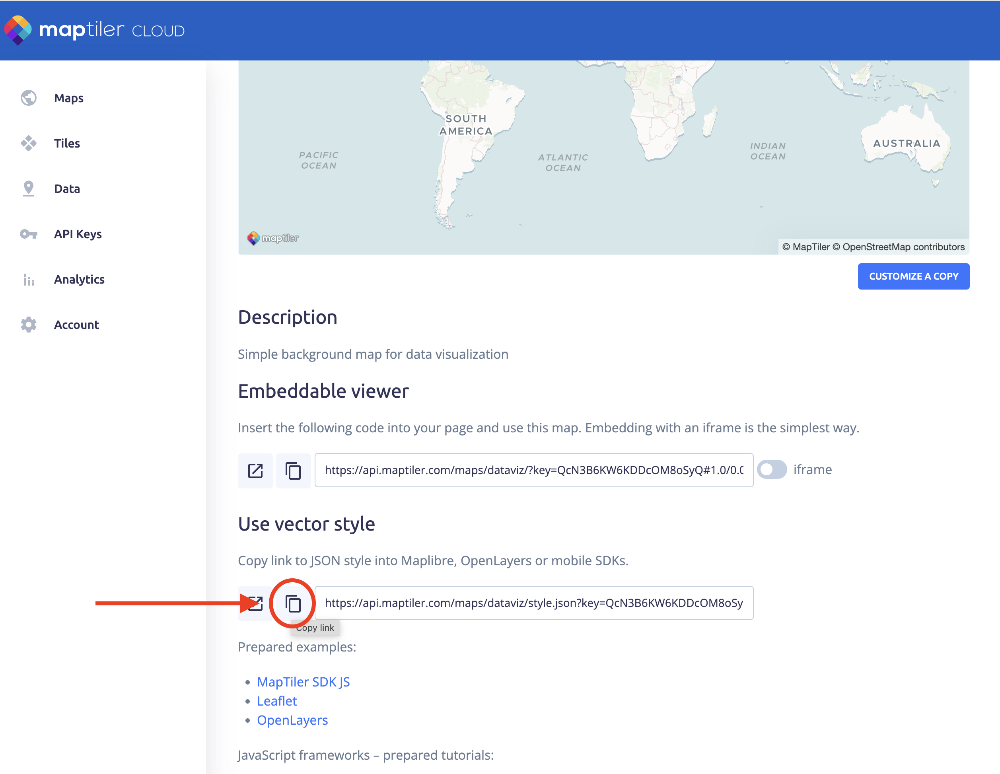
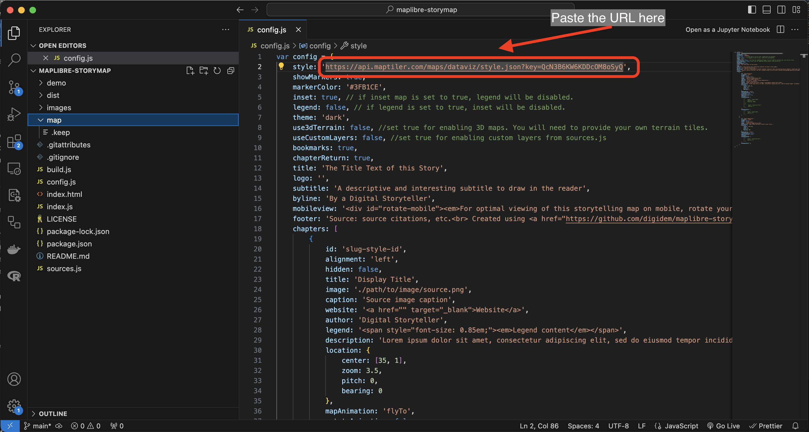

# Agregar un Estilo de Mapa

Los mapas web se muestran utilizando un conjunto de reglas que tratan cada elemento del mapa de una manera específica para renderizarlos usando los colores, iconos y formas que ves en tu pantalla. Estas reglas se almacenan en un archivo que puede estar en tu computadora o puede ser accedido a través de una URL.

Utilizaremos los OpenMapStyles de [MapTiler](https://openmaptiles.org/). Si no tienes una cuenta de MapTiler, consulta la sección de prerrequisitos para crear una cuenta gratuita.

Sigue estos pasos para agregar un estilo de mapa a tu mapa narrativo.

### *1*{: .circle .circle-blue} Inicia sesión en tu cuenta de `MapTiler`.

En tu navegador web, ve a [este enlace](https://cloud.maptiler.com/auth/widget?next=https://cloud.maptiler.com/maps/).
Ingresa tu nombre de usuario y contraseña.

  

### *2*{: .circle .circle-blue} Selecciona el estilo de mapa que quieres usar.

En la pantalla de MapTiler Maps verás una lista de estilos abiertos predefinidos.

Haz clic en `DataViz` si quieres seguir este tutorial, o cualquier otro estilo que prefieras.

 

Puedes crear tus propios estilos usando MapTiler OpenMapTyles haciendo clic en el botón `New map`. Puedes seleccionar qué capas mostrar y cómo.
{: .note }

### *3*{: .circle .circle-blue} Copia la URL del estilo vectorial

Copia la URL del estilo. Puedes usar el botón `Copy link`.

Asegúrate de usar el `vector style` que se encuentra bajo el título 'Use vector style'.
{: .warn}



### *4*{: .circle .circle-blue} Pega la URL del estilo en el archivo config.js

Regresa al archivo `config.js` que tienes abierto en `Visual Studio Code` y pega la URL que acabas de copiar en la propiedad `style:`.

Input
{: .label .label-green }
```
2  style: 'https://api.maptiler.com/maps/dataviz/style.json?key={tu_propia_clave}'
```


El estilo puede definirse usando una URL, como en esta demostración, o usando un archivo `.json`. Si creas tu propio estilo y quieres usar un archivo json, debes guardar ese archivo en la carpeta `map` en el repositorio y apuntar la propiedad style a él usando `style: '\map\style.json'`. Los estilos personalizados pueden crearse y guardarse como archivos json en aplicaciones como [Maputnik](https://maputnik.github.io/) o [Mapbox Studio](https://www.mapbox.com/mapbox-studio).
{: .note }