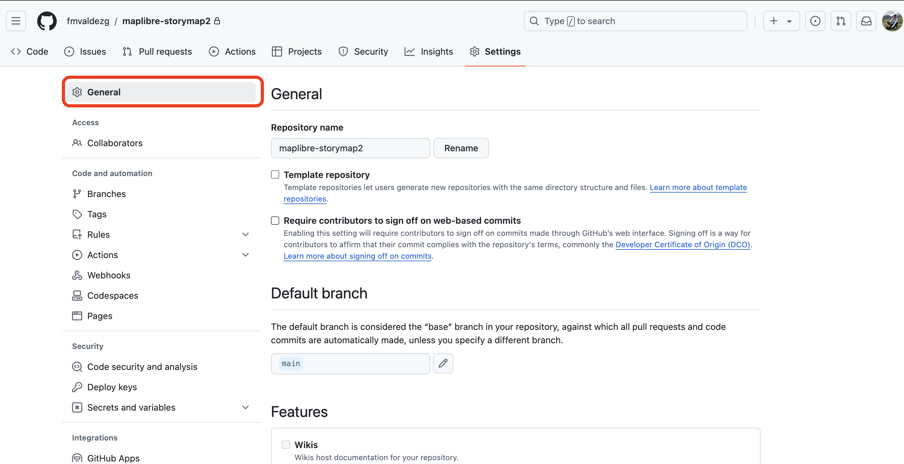
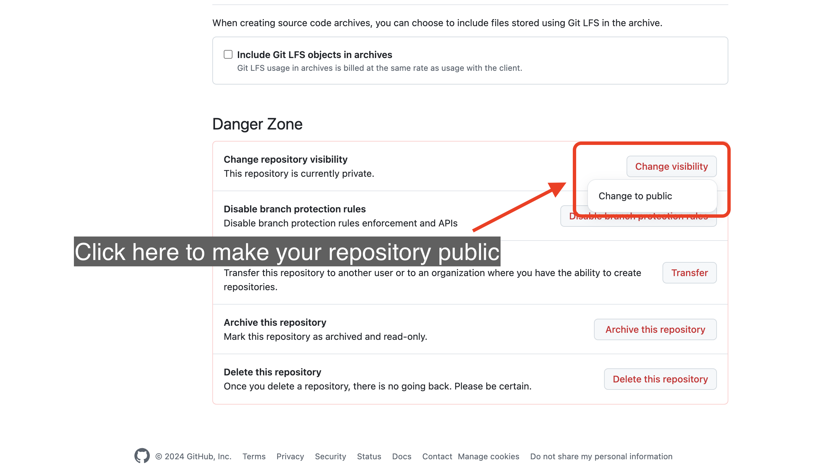
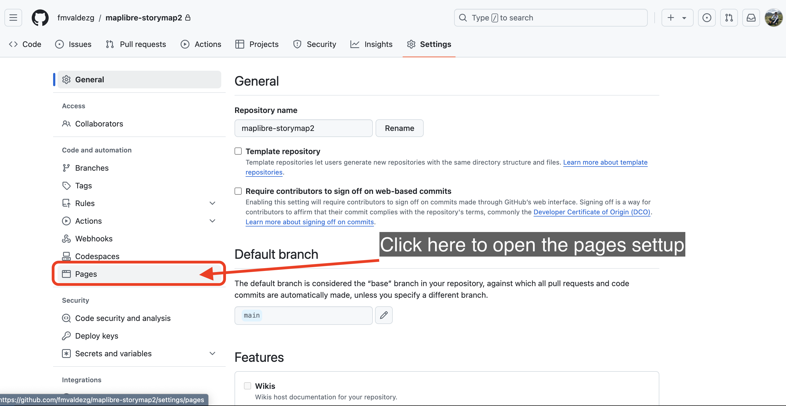

## Implementar tu mapa narrativo como página web

Ahora que tu mapa narrativo está terminado, es hora de implementarlo como una página web. Para eso utilizaremos `GitHub Pages`.

[GitHub Pages](https://docs.github.com/en/pages/getting-started-with-github-pages/about-github-pages) es un servicio de alojamiento de sitios estáticos que toma archivos HTML, CSS y JavaScript directamente desde un repositorio en GitHub, opcionalmente procesa los archivos a través de un proceso de construcción, y publica un sitio web.

Para publicar tu mapa como una página web, sigue estos pasos:

Paso 1
{: .label .label-step}

Ve a la nube de `GitHub` e inicia sesión en tu cuenta.

Puedes hacer clic en el botón `View on GitHub` en tu aplicación `GitHub Desktop` para abrir el repositorio en tu navegador.

 

Paso 2
{: .label .label-step}

En tu repositorio, haz clic en el botón `Settings` en la barra de menú superior.

Paso 3
{: .label .label-step}

Si no lo hiciste antes, tendrás que hacer tu repositorio `público` para poder usar GitHub Pages.

Simplemente haz clic en el botón `General` en el panel de la izquierda.

Desplázate hasta la parte inferior de la página y haz clic en `Change visibility` y luego en `Change to public`.

Confirma que deseas hacer público el repositorio.

Es posible que se te pida que ingreses la contraseña de tu cuenta para confirmar.
{: .warn }

Paso 4
{: .label .label-step}

En la Configuración del repositorio, haz clic en el botón `Pages` en las opciones del panel izquierdo.

Paso 5
{: .label .label-step}

En la configuración de Pages, haz clic en el menú desplegable bajo el título `Branch` y selecciona la opción de rama `main`.

Luego haz clic en `Save`. Un mensaje como el que se muestra a continuación aparecerá en la pantalla.

Paso 6
{: .label .label-step}

Espera unos segundos y luego actualiza la página.

Una nueva sección aparecerá en la ventana de configuración de `Pages` con los detalles de tu página implementada.

Haz clic en el botón `Visit site` para abrir el mapa narrativo en una nueva ventana del navegador.

Cada vez que cambies algo en tu archivo `config.js` o agregues algo a tu repositorio, `GitHub Pages` construirá los archivos de renderizado e implementará la nueva versión de tu mapa. Lo único que tienes que hacer es `commit` tus cambios y `push` los cambios a la nube si estás usando `GitHub Desktop`.
{: .warn }

