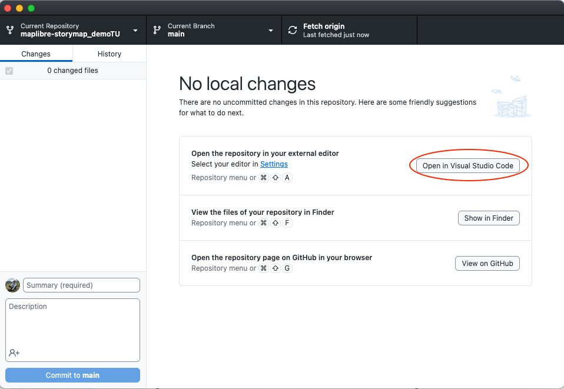
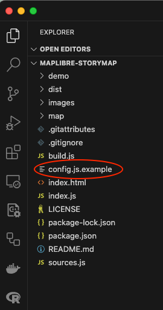
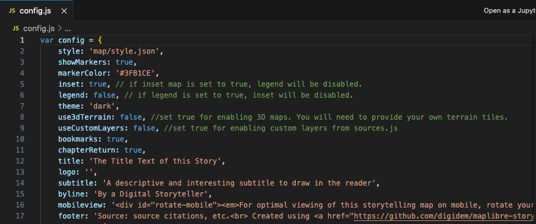

# Editar el archivo config.js
Primero vamos a hacer algunas ediciones rápidas al archivo config.js de tu nuevo repositorio. Este archivo contiene el contenido principal de la historia y los controles del mapa.

### *1*{: .circle .circle-blue} Abre los archivos de tu repositorio en `Visual Studio Code`.

Mientras estás en `GitHub Desktop`, haz clic en la opción `Open in Visual Studio Code`

  

Esto abrirá `Visual Studio Code`.

### *2*{: .circle .circle-blue} Renombra el archivo.  

Verás una lista con todos los archivos y carpetas en tu repositorio. 

  

Haz clic derecho en el archivo `config.js.template` y selecciona la opción `Rename`.

  

Cambia el nombre del archivo a `config.js`, sin la palabra template al final.

### *3*{: .circle .circle-blue} Haz algunas ediciones a tu archivo `config.js`.  

Haz clic en el archivo que acabas de renombrar. Su contenido se mostrará en el panel central de GitHub Desktop.

Las primeras 17 líneas de este archivo contienen las configuraciones principales para tu nuevo mapa narrativo. 
Vamos a cubrir algunas de ellas para iniciar tu mapa de historia. 



Paso 1
{: .label .label-step}

Dale un título a tu mapa reemplazando el texto después de `title:`

Input
{: .label .label-green }
```
12  title: 'Mi primer Mapa Narrativo'
```

Ten en cuenta que todas estas propiedades están construidas por un par de valores. Los valores que no sean booleanos (true, false) deben estar entre ``. 
{: .warn}

Paso 2
{: .label .label-step}

Inserta un `subtitle` para tu mapa narrativo. Escribe cualquier texto que quieras que aparezca en el subtítulo. Recuerda que debe estar entre ``.

Input
{: .label .label-green }
```
14  subtitle: '¡Este es el mapa narrativo más increíble jamás creado!'
```
Paso 3
{: .label .label-step}

Pon tu nombre como autor del mapa narrativo cambiando el texto de la propiedad byline.

Input
{: .label .label-green }
```
15  byline: 'Felipe Valdez'
```

Paso 4
{: .label .label-step}

Añade información adicional a tu mapa narrativo en la propiedad `footer`. Este es un lugar que puedes usar para atribuir los datos o mencionar cualquier organización involucrada en la creación del mapa. Además, es una buena práctica mantener el MapLibre Storytelling y el enlace al proyecto tal como está después de `<br>`.

Input
{: .label .label-green }
```
17  footer: 'Fuente: Bibliotecas de la Universidad Temple<br> Creado usando la plantilla <a href="https://github.com/digidem/maplibre-storymap" target="_blank">MapLibre Storytelling</a>.',
```
La mayoría de estas propiedades permiten texto con formato HTML. Esto significa que puedes añadir diferentes estilos, enlaces y otras características. Si quieres aprender más sobre HTML sigue este [enlace](https://developer.mozilla.org/en-US/docs/Learn/Getting_started_with_the_web/HTML_basics).
{: .note}

### *+*{: .circle .circle-blue} Propiedades adicionales y su funcionalidad.

El resto de las propiedades en esta sección te permiten cambiar otros aspectos del mapa narrativo. Cubriremos la propiedad `style` en la siguiente sección. Las otras propiedades se describen a continuación.

| Propiedad | Función
| --- | ---
| `style:` | Este es el estilo de MapLibre que se utilizará para la aplicación. Puedes configurarlo a cualquier estilo de MapLibre alojado en línea o localmente, pero por defecto está configurado para buscar un estilo en el directorio map/.
| `showMarkers:` | Esto controla si se muestran marcadores en el punto central de cada capítulo. Si es true, el mapa mostrará un icono azul predeterminado en forma de lágrima invertida.
| `markerColor:` | Si showMarkers es true, esta propiedad anulará el color azul claro predeterminado del marcador.
| `inset:` | Muestra un mini-mapa insertado. Se desactivará si legend está configurado como true.
| `legend:` | Muestra una caja en la parte inferior derecha en la que puedes añadir contenido HTML para cada capítulo, sirviendo como leyenda. Se desactivará si inset está configurado como true.
| `theme:` | Hay dos temas básicos disponibles (light y dark).

Propiedades opcionales

| Propiedad | Función
| --- | ---
| `use3dTerrain` | Habilita el terreno 3D. Necesitarás proporcionar tus propios mosaicos de terreno.
| `useCustomLayers:` | Permite añadir fuentes y capas personalizadas según lo definido en `sources.js`.
| `bookmarks:` | Permite añadir enlaces de marcadores en el encabezado y pie de página para cada capítulo. Se añadirán marcadores para cualquier capítulo que tenga un título.
| `chapterReturn:` | Para habilitar un enlace "Volver al principio" al final de cada capítulo.
| `logo:` | Añade una imagen de logo al encabezado de tu historia.
| `mobileview:` | Muestra una nota útil para rotar el dispositivo cuando se visualiza el mapa narrativo en un móvil. Este es contenido HTML y puede ser modificado en `config.js`.

_Fuente: [MapLibre Storytelling - Digital Democracy](https://github.com/digidem/maplibre-storymap)._