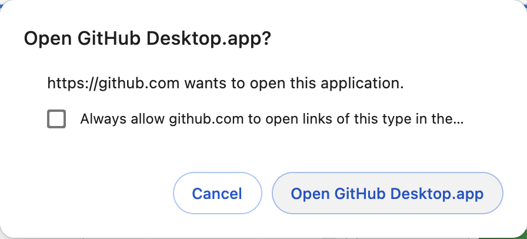
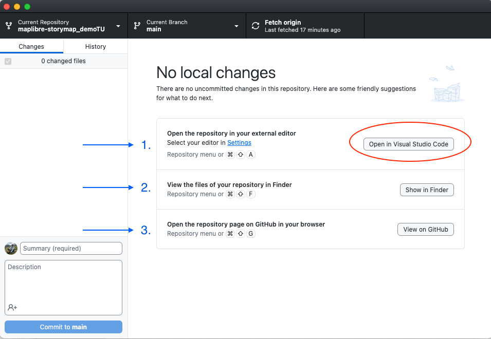

# Clonar la plantilla de narración
En este taller vamos a duplicar la plantilla de narración creada por [Digital Democracy](https://www.digital-democracy.org/) a tu propia cuenta de GitHub, y luego haremos algunas ediciones juntos. Puedes modificar y reutilizar esta plantilla en cualquier momento desde tu propia cuenta.

### *1*{: .circle .circle-blue} Ve al repositorio [Interactive Storytelling with MapLibre](https://github.com/digidem/maplibre-storymap){:target="_blank"}

### *2*{: .circle .circle-blue} Haz clic en la opción para abrir el repositorio en GitHub Desktop
Bajo el botón `Code`, verás una opción para `Open with GitHub Desktop` (Abrir con GitHub Desktop).   

Confirma que deseas abrirlo haciendo clic en `Open GitHub Desktop.app` en el mensaje que aparece.

Alternativamente, si estás usando GitHub en la web, simplemente bifurca el repositorio a tu cuenta y continúa desde allí.
{: .note}

`GitHub Desktop` debería abrirse en tu computadora y deberías ver una ventana con la información del repositorio bifurcado, incluyendo un panel que lista los cambios (estará vacío ya que es la primera vez que lo abres) y tres opciones para comenzar a trabajar en tu repositorio:

Si tienes `Visual Study Code` instalado, deberías ver el texto `Open in Visual Studio Code` (Abrir en Visual Studio Code) en el botón de acción. Si no lo tienes pero tienes un editor diferente (como RStudio, XCode o Atom), entonces deberías ver esa opción. Si necesitas configurar `Visual Studio Code` como el editor predeterminado para tu GitHub Desktop, entonces sigue las instrucciones [aquí](https://docs.github.com/en/desktop/configuring-and-customizing-github-desktop/configuring-a-default-editor-in-github-desktop#configuring-a-custom-editor).
{: .warn}

1. Abrir el repositorio en tu editor externo.

2. Ver los archivos de tu repositorio en el Finder.

3. Abrir la página del repositorio en GitHub en tu navegador.

