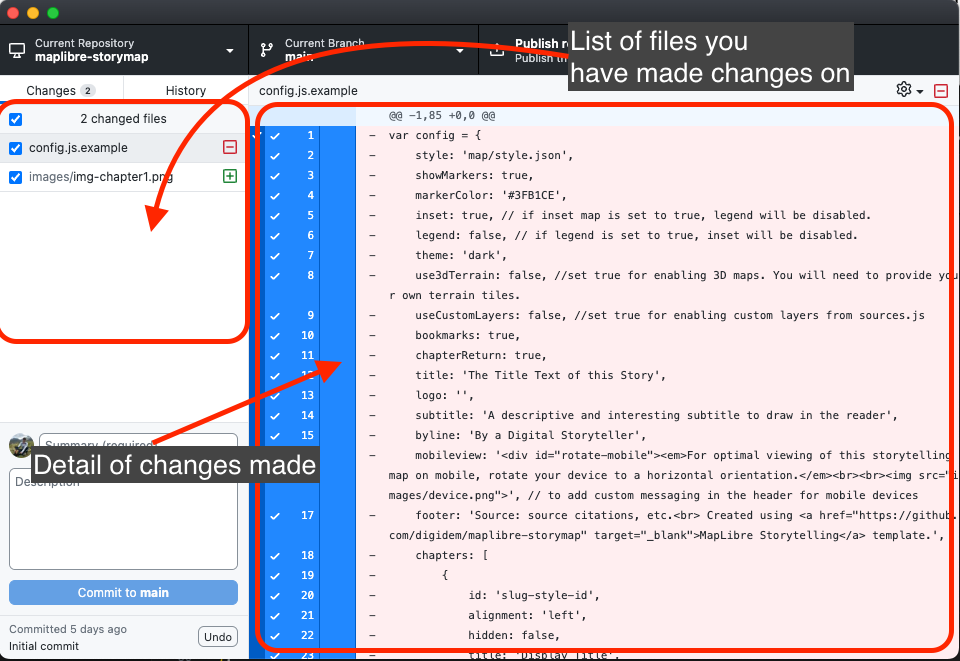
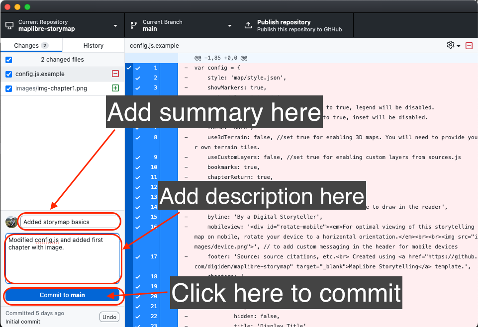
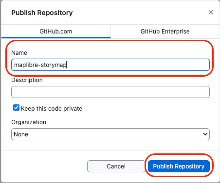

# Vista previa de tu mapa

Una vez que hayas configurado y agregado los elementos básicos a tu mapa narrativo, es una buena práctica previsualizarlo antes de implementarlo como una página web.

Para hacerlo, vamos a utilizar la funcionalidad de servidor en vivo de `Visual Studio Code`. Esto implementará el mapa narrativo localmente en tu computadora.

Sigue los pasos a continuación para previsualizar tu mapa narrativo.

### *1*{: .circle .circle-blue} Confirma tus cambios en `GitHub`.

Una de las funciones de Git como sistema de control de versiones es tomar instantáneas de los cambios que haces en tus archivos.

Un `commit` es una instantánea de tu proyecto en ese momento.

Para hacer `commit` de tus cambios:

Paso 1
{: .label .label-step}

Ve a la aplicación `GitHub Desktop`.

Verás todos los archivos que has cambiado listados en el panel del lado izquierdo, y todos los cambios que has hecho en esos archivos en el panel del centro. Si agregaste algo al archivo, estará resaltado en verde y si eliminaste algo, en rojo.

Revisa los cambios que has realizado.

Paso 2
{: .label .label-step}

En el panel inferior izquierdo, escribe un resumen para el commit y, opcionalmente, una descripción. Es una buena práctica mantener un registro detallado de los cambios realizados, especialmente si más de una persona está trabajando en el proyecto.

Luego haz clic en `Commit to main`.

Paso 3
{: .label .label-step}

Después de confirmar los cambios, `GitHub Desktop` mostrará la ventana principal del repositorio y habilitará la opción para `Publish repository`. Una copia de tu repositorio ahora está disponible en la nube de GitHub.

Adelante, publica tu repositorio haciendo clic en `Publish repository`.

La primera vez que hagas esto, se te pedirá que establezcas un nombre para tu repositorio y una descripción opcional. Luego haz clic en `Publish Repository`.

### *2*{: .circle .circle-blue} Vista previa de tu mapa narrativo localmente.

Ahora que has publicado tu repositorio en la nube de GitHub, regresa a `Visual Studio Code`.

Para visualizar una vista previa de tu mapa narrativo, haz clic en el botón `Go Live` ubicado en la barra en la esquina inferior derecha.

Se abrirá una nueva ventana en tu navegador de internet predeterminado. Verás una vista previa de tu mapa narrativo.

Ahora puedes agregar o modificar tu archivo `config.js` y ver los cambios en vivo en tu computadora local. Para hacerlo, simplemente guarda los cambios que realizaste en `Visual Studio Code` (presiona ctrl + s) y actualiza la ventana del navegador web.

Este mapa es solo una vista previa. Todavía está viviendo en tu sistema. Para publicarlo como una página web para ser compartida y visualizada por cualquier persona, sigue las instrucciones en la siguiente sección de este tutorial.
{: .note }

