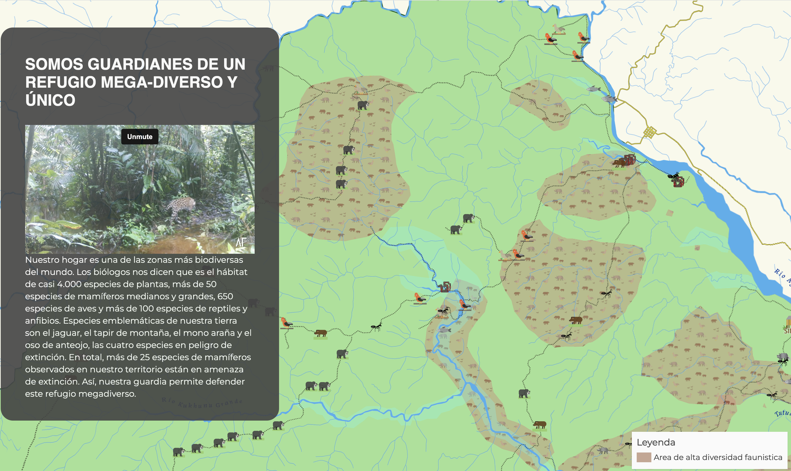

# ¿Por qué usar mapas para contar historias?

Los mapas siempre han sido una herramienta vital para la narración de historias. No solo proporcionan contexto para las narrativas que contamos; también sirven como formas visualmente atractivas de presentar información a audiencias diversas. Las tecnologías modernas han mejorado estos mapas, añadiendo el poder del análisis espacial mientras ofrecen la capacidad de generar y compartir datos en tiempo real y de manera colaborativa. Esto significa que quienes ven el mapa también pueden participar en su creación, transformándolos de meros observadores a participantes activos en la historia que el mapa cuenta.

# Consulta algunos ejemplos de mapas narrativos aquí

[La Evolución de los Establos de Caballos de Fletcher Street. Un Legado de los Jinetes Negros de Filadelfia: Pasado y Presente](https://fletcherststorymap.com/)

<a src="https://fletcherststorymap.com/">

[Nuestro Territorio es Nuestra Vida](https://lab.digital-democracy.org/mapa-sinangoe/)

<a src="https://lab.digital-democracy.org/mapa-sinangoe/">

[Diez Conflictos a Vigilar en 2022](https://conflicts2022.crisisgroup.org/)

<a src="https://conflicts2022.crisisgroup.org/">

[Polar Star Inn y Seipel Hut (Cabaña de Carl)](https://map.huttrip.com/)

<a src="https://map.huttrip.com/">