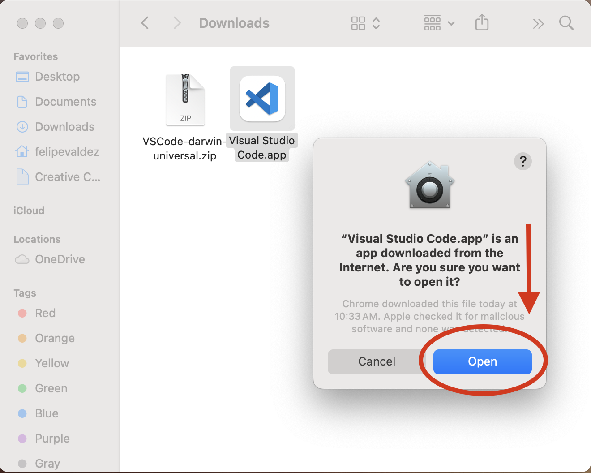

# Prerrequisitos
{: .no_toc }

Para este tutorial, necesitarás completar (o tener) lo siguiente:
- TOC
{:toc}

Sigue las instrucciones en las secciones a continuación para completar estos prerrequisitos.

## *1*{: .circle .circle-blue} Crear una cuenta de `GitHub`

Si quieres aprender más sobre Git y GitHub, recomendamos el siguiente [tutorial](https://ubc-library-rc.github.io/intro-git/). 

Paso 1
{: .label .label-step}

Ve a [github.com/signup](https://github.com/signup?ref_cta=Sign+up&ref_loc=header+logged+out&ref_page=%2F&source=header-home)

Paso 2
{: .label .label-step}

Escribe tu `correo electrónico`, una `contraseña` y un `nombre de usuario` para tu nueva cuenta. Luego haz clic en `Continue`.

Paso 3
{: .label .label-step}

Se te harán algunas preguntas.
Cuando se te solicite, asegúrate de seleccionar `Continue for free` en el tipo de cuenta.

Paso 4
{: .label .label-step}

Recibirás un correo electrónico con un código de activación. Introduce el código cuando se te solicite en la página web de GitHub.
{: .warn}

Ahora estás listo para crear tu primer repositorio.

## *2*{: .circle .circle-blue} Descargar e instalar `GitHub Desktop`

GitHub Desktop es una aplicación gratuita y de código abierto que te ayuda a trabajar con archivos alojados en GitHub u otros servicios de alojamiento Git.
Si quieres aprender más sobre esta aplicación, ve [aquí](https://docs.github.com/en/desktop/overview/about-github-desktop).

Dependiendo del sistema operativo (SO) de tu computadora, los siguientes pasos pueden parecer un poco diferentes. En este taller usamos MacOS, pero se puede hacer en cualquier SO. 
{: .warn}

Paso 1
{: .label .label-step}

Inicia sesión en tu cuenta de `GitHub`, sigue [este enlace](https://github.com/apps/desktop/?ref_cta=download+desktop&ref_loc=installing+github+desktop&ref_page=docs) a la página de descargas y haz clic en el botón `Download now`.

Paso 2
{: .label .label-step}

Una vez descargado, encontrarás un nuevo archivo `.zip` en tu carpeta de `Descargas`. 
Simplemente puedes hacer doble clic en él (o clic derecho y descomprimir archivo).

Paso 3
{: .label .label-step}

Verás el icono de `GitHub Desktop` junto al archivo descargado. Solo arrastra el icono y suéltalo en tu carpeta de `Aplicaciones`.

Paso 4
{: .label .label-step}

Haz doble clic en el icono de `GitHub Desktop` para abrir la aplicación.

La primera vez que abras `GitHub Desktop`, verás un mensaje de tu sistema pidiendo permiso para abrir la aplicación. Simplemente haz clic en `Abrir`.

## *3*{: .circle .circle-blue} Descargar e instalar `VS Code`

Paso 1
{: .label .label-step}

En tu navegador de internet, ve a la página de descargas de [code.visualstudio.com](https://code.visualstudio.com/) y haz clic en el botón `Download` en la esquina superior derecha.

Paso 2
{: .label .label-step}

Selecciona el instalador apropiado para el sistema operativo de tu computadora. En este caso estamos usando MacOS.

El botón de descarga en la pantalla principal debería dirigirte a la versión correcta para tu equipo.
{: .warn }

Paso 3
{: .label .label-step}

Una vez descargado, encontrarás un nuevo archivo `.zip` en tu carpeta de `Descargas`. 
Simplemente puedes hacer doble clic en él (o clic derecho y descomprimir archivo).

Paso 4
{: .label .label-step}

Verás el icono de `Visual Studio Code` junto al archivo descargado. Solo arrastra el icono y suéltalo en tu carpeta de `Aplicaciones`.

Paso 5
{: .label .label-step}

Haz doble clic en el icono de `Visual Studio Code` para abrir la aplicación.

La primera vez que abras `Visual Studio Code`, verás un mensaje de tu sistema pidiendo permiso para abrir la aplicación. Simplemente haz clic en `Abrir`.

## *4*{: .circle .circle-blue} Crear una cuenta de `MapTiler`

MapTiler es una plataforma de software para construir mapas digitales. 
MapTiler mantiene el proyecto de código abierto [OpenMapTiles](https://openmaptiles.org/) que consiste en un conjunto de herramientas que permiten a todos crear sus propios mosaicos de mapas vectoriales a partir de datos de OpenStreetMap para alojamiento, auto-alojamiento o uso sin conexión.
En este tutorial usaremos el plan gratuito de MapTiler para acceder a sus mosaicos vectoriales alojados y usar el estilo OpenMapTiles.

Paso 1
{: .label .label-step}

En tu navegador, ve a la página principal de [MapTiler.com](https://www.maptiler.com/) y haz clic en `Create a free account`.

Paso 2
{: .label .label-step}

Inicia sesión usando tu dirección de correo electrónico o tu cuenta de Google si tienes una.
Escribe tu nombre y una contraseña para tu cuenta. Luego haz clic en `Save` para continuar.

Paso 3
{: .label .label-step}

Recibirás un correo electrónico para verificar tu cuenta. Haz clic en el enlace del correo electrónico para ser redirigido a tu cuenta de `MapTiler`.
{: .warn }

Ahora puedes iniciar sesión usando tu correo electrónico y la contraseña que creaste en el paso anterior.

Paso 4
{: .label .label-step}

Ahora estás listo para comenzar a crear y usar Maptiles y estilos de mapas en MapTiler

